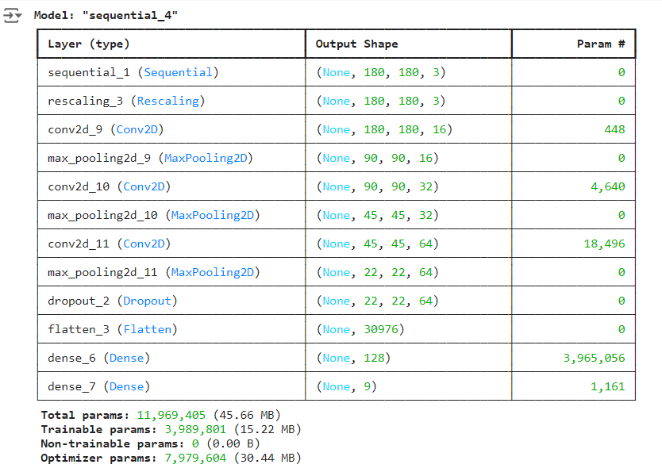

# Melanoma Skin Cancer Detection

## Problem statement

To build a CNN based model which can accurately detect melanoma. Melanoma is a type of cancer that can be deadly if not detected early. It accounts for 75% of skin cancer deaths. A solution which can evaluate images and alert the dermatologists about the presence of melanoma has the potential to reduce a lot of manual effort needed in diagnosis.

## Table of Contents

- [General Info](#general-information)
- [Model Architecture](#model-architecture)
- [Model Summary](#model-summary)
- [Model Evaluation](#model-evaluation)
- [Technologies Used](#technologies-used)
- [Acknowledgements](#acknowledgements)
- [Collaborators](#collaborators)

<!-- You can include any other section that is pertinent to your problem -->

## General Information

The dataset contains 2357 images of malignant and benign oncological conditions, sourced from the International Skin Imaging Collaboration (ISIC). These images are categorized based on the classification provided by ISIC, with each subset containing an equal number of images.

In order to address the challenge of class imbalance, the Augmentor Python package (https://augmentor.readthedocs.io/en/master/) is employed to augment the dataset. This involved generating additional samples for all classes, ensuring that none of the classes had insufficient representation.

## Pictorial representation of skin types

The aim of this task is to assign a specific class label to a particular type of skin cancer.

## Model Architecture

The break down of the final provided CNN architecture step by step:

**Normalization**: The `Rescaling(1./255)` layer is added to normalize the pixel values of the input images. Normalization typically involves scaling the pixel values to a range between 0 and 1, which helps in stabilizing the training process and speeding up convergence.

**Output Layer**: The number of neurons in the output layer is determined by the `target_labels` variable, representing the number of classes in the classification task. The output layer does not have an activation function specified, as it is followed by the loss function during training.

**Model Compilation**: The model is compiled with the Adam optimizer (`optimizer='adam'`) and the Sparse Categorical Crossentropy loss function (`loss=tf.keras.losses.SparseCategoricalCrossentropy(from_logits=True)`), which is suitable for multi-class classification problems. Additionally, accuracy is chosen as the evaluation metric (`metrics=['accuracy']`).

**Training**: The model is trained using the `fit` method with the specified number of epochs (`epochs=50`). The `ModelCheckpoint` and `EarlyStopping` callbacks are employed to monitor the validation accuracy during training. The `ModelCheckpoint` callback saves the model with the best validation accuracy, while the `EarlyStopping` callback stops training if the validation accuracy does not improve for a specified number of epochs (patience=5 in this case). These callbacks help prevent overfitting and ensure that the model converges to the best possible solution.

## Model Summary

## Model Evaluation

## Technologies Used

- [Python](https://www.python.org/) - version 3.13.1
- [Matplotlib](https://matplotlib.org/) - version 3.7.1
- [Numpy](https://numpy.org/) - version 1.26.4
- [Pandas](https://pandas.pydata.org/) - version 2.2.2
- [Seaborn](https://seaborn.pydata.org/) - version 0.13.2
- [Tensorflow](https://www.tensorflow.org/) - version 2.17.0

<!-- As the libraries versions keep on changing, it is recommended to mention the version of library used in this project -->

## Acknowledgements

- UpGrad tutorials on Convolution Neural Networks (CNNs)

- [Introduction to CNN](https://www.analyticsvidhya.com/blog/2021/05/convolutional-neural-networks-cnn/)

- [Image classification using CNN](https://www.analyticsvidhya.com/blog/2020/02/learn-image-classification-cnn-convolutional-neural-networks-3-datasets/)

- [Efficient way to build CNN architecture](https://towardsdatascience.com/a-guide-to-an-efficient-way-to-build-neural-network-architectures-part-ii-hyper-parameter-42efca01e5d7)

## Collaborators

Created by [@mrsivanandareddy](https://github.com/mrsivanandareddy)
